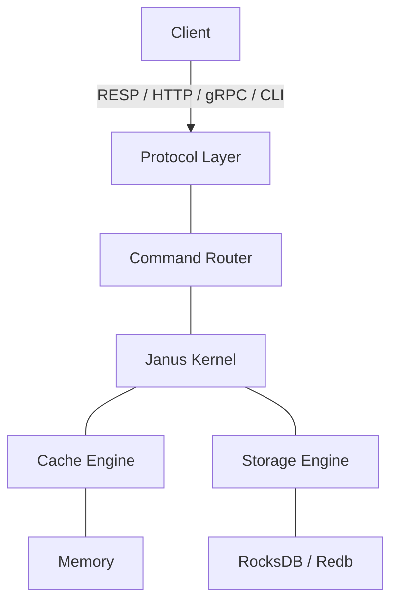
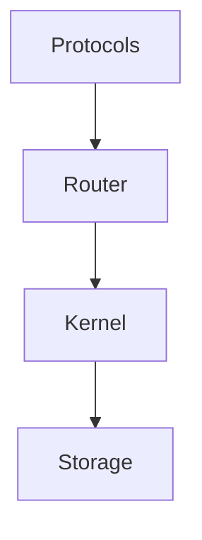
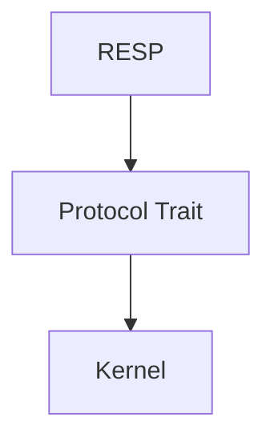
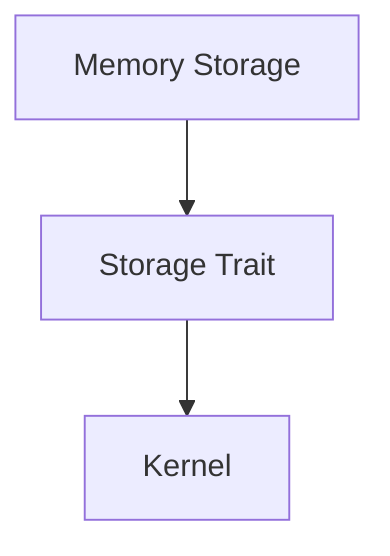
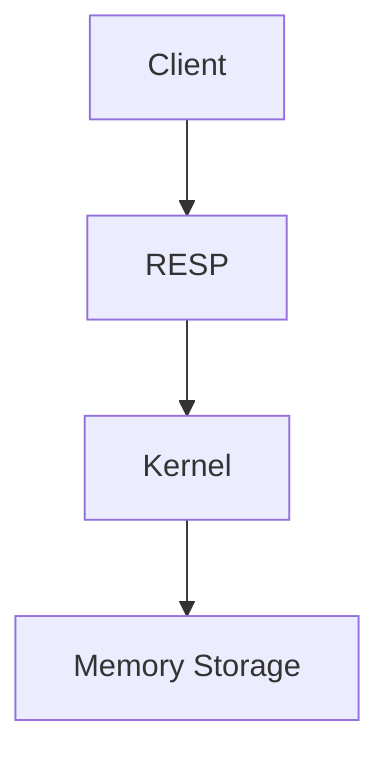

# Architecture

> Janus is designed as a layered and modular data kernel.

# High-Level Architecture

# Layer Responsibilities

## Client Layer

Clients are external applications interacting with Janus.

Examples:

- Redis clients (RESP)
- HTTP clients
- gRPC clients
- CLI tools

Clients never communicate directly with the storage engine.

## Protocol Layer

Responsible for translating external protocols into internal commands.

Examples:

- RESP parser
- HTTP API
- gRPC service

Protocols should never execute business logic.

## Command Router

Receives normalized commands from protocol implementations and forwards them to the kernel.

This layer isolates protocol-specific behavior from execution.

## Kernel

The kernel is the heart of Janus.

It coordinates every operation without depending on specific storage implementations.

Responsibilities include:

- command execution
- validation
- lifecycle
- event dispatching
- plugin orchestration

The kernel does not know whether data is stored in memory, disk or a remote system.

## Cache Engine

Responsible for:

- TTL
- eviction
- cache policies
- expiration

Initially only an in-memory implementation will exist.

Future implementations may support:

- TinyLFU
- LRU
- LFU

## Storage Engine

Responsible for reading and writing data.

The storage engine exposes a stable interface while allowing multiple implementations.

Possible implementations:

- Memory
- RocksDB
- Redb
- Sled
- Custom storage

## Persistence Layer

Responsible for durable storage.

Possible implementations include:

- Snapshots
- Write-Ahead Log (WAL)
- Append Only File (AOF)

Persistence should remain independent from networking and protocols.

# Core Design Principles

Every layer should have one responsibility.

Every dependency should point downward.

Lower layers must never depend on upper layers.

Communication should happen through abstractions instead of concrete implementations.

# Modularity

Every subsystem should be independently replaceable.

Examples:

or

No subsystem should require modifications in unrelated modules.

# Future Architecture

Future versions may introduce additional layers.

Examples:

- Replication
- Cluster management
- Transactions
- Metrics
- Tracing
- Plugin system
- Security
- Authentication

These components should integrate with existing abstractions instead of changing the kernel.

# Initial Scope

The first milestone intentionally keeps the architecture small.

Only after validating the architecture will additional modules be introduced.

The objective is to evolve the architecture incrementally while maintaining simplicity.