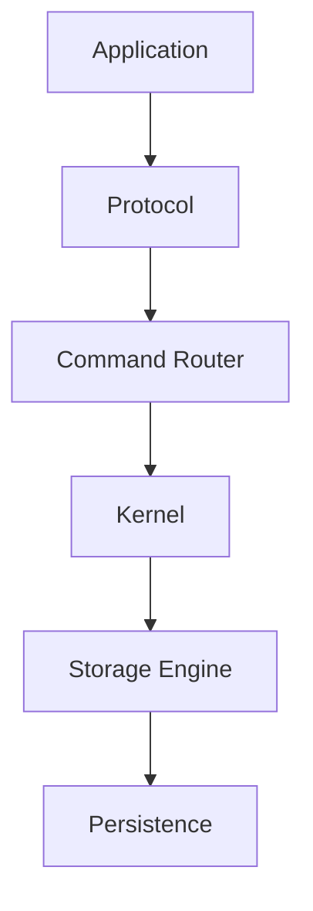

# Janus Vision

> A modular data kernel built to learn, experiment and evolve.

# 1. Purpose

Modern data systems often solve a very specific problem.

- Redis focuses on in-memory data structures.
- PostgreSQL focuses on relational data.
- CockroachDB focuses on distributed SQL.
- Dragonfly focuses on high-performance caching.

Each of these systems makes architectural decisions that optimize one particular use case.

Janus has a different purpose.

Janus is not intended to replace existing databases.

Instead, it is designed as a modular data kernel where storage engines,
network protocols, cache policies and distributed features can evolve
independently while sharing a common execution model.

The project exists primarily as a long-term engineering laboratory for
learning systems programming, distributed systems and software architecture.

# 2. Vision

Janus aims to become a platform where new ideas can be implemented,
measured and replaced without requiring a complete redesign.

Every subsystem should be replaceable.

Protocols should not know how data is stored.

Storage engines should not know how requests arrived.

Networking should not know how commands are executed.

The kernel should coordinate these components while keeping each module
small, understandable and independently testable.

# 3. Core Principles

## Learn by Building

Every major subsystem should be implemented from first principles before
introducing external abstractions.

The objective is understanding, not only productivity.

## Simplicity Before Performance

Performance matters.

However, architectural clarity is considered more valuable during the
early stages of the project.

Optimizations should only happen after behavior is fully understood and
measured.

## Composition Over Complexity

Components should communicate through explicit interfaces.

New capabilities should be added through composition instead of tightly
coupled implementations.

## Modularity

Every major responsibility should exist as an independent module.

Examples include:

- Protocols
- Storage engines
- Cache policies
- Persistence
- Replication
- Cluster management

## Observability

Every subsystem should expose enough information to understand:

- execution
- latency
- memory usage
- storage behavior

Debugging should never depend on guesswork.

# 4. Architecture Philosophy

Janus is designed around layers.

Each layer should have a single responsibility.

Communication between layers should happen through stable abstractions.

# 5. Design Goals

The project should remain:

* Easy to understand
* Easy to extend
* Easy to replace components
* Easy to benchmark
* Easy to debug

# 6. Non Goals

Janus is **not** intended to:

* Replace Redis
* Replace PostgreSQL
* Compete with mature databases
* Optimize every workload
* Support every protocol

The project prioritizes architectural quality and learning over feature count.

# 7. Learning Goals

The project intentionally explores several engineering disciplines.

These include:

* Rust
* Memory management
* Network programming
* Storage engines
* Distributed systems
* Consensus algorithms
* Serialization
* Software architecture
* Benchmarking
* Performance analysis

Every milestone should introduce at least one new engineering concept.

# 8. Long-term Direction

As the project evolves, Janus may support:

* Multiple storage engines
* Multiple network protocols
* Replication
* Distributed clusters
* Transactions
* Plugin architecture
* Metrics
* Tracing

These features should emerge naturally from the architecture rather than
being forced into the system.

# 9. Final Statement

Janus is an engineering project.

Its success is not measured by replacing existing databases, but by the
quality of its architecture, the clarity of its implementation and the
knowledge gained throughout its development.